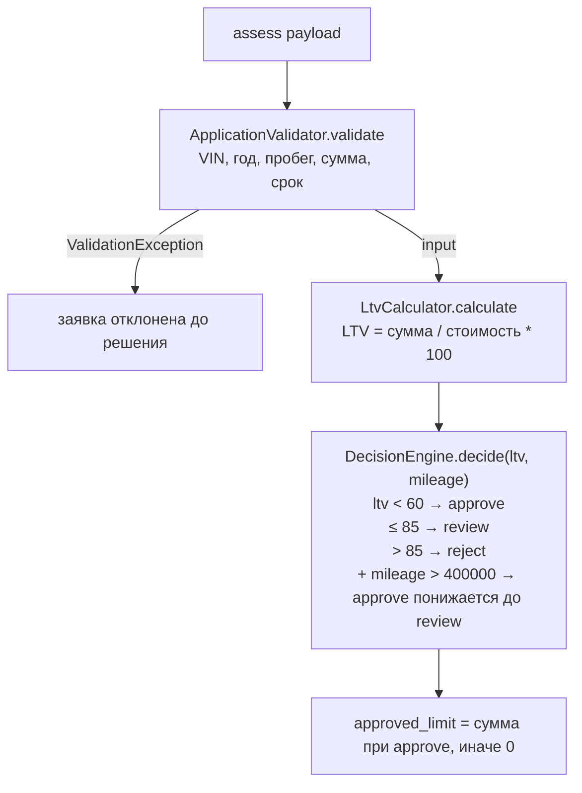

# Карта кода: как считается решение approve / review / reject

Обзор `backend/src/Domain/` и `backend/config/rules.php`. Все числа — учебные и синтетические.

## Участники

- `backend/config/rules.php` — справочник бизнес-правил (пороги и лимиты).
- `backend/src/AppFactory.php` — вне Domain: подключает `rules.php` и собирает объекты
  (`ApplicationValidator`, `LtvCalculator`, `DecisionEngine($rules['ltv'])`, `VehicleAge((int) date('Y'))`).
- Внутри Domain:
  - `AssessmentService.php` — оркестратор;
  - `ApplicationValidator.php` — валидация входа (+ `VinValidator.php`, `VehicleAge.php`);
  - `LtvCalculator.php` — расчёт LTV;
  - `DecisionEngine.php` — решение по LTV;
  - `ValidationException.php` — ошибка валидации со списком «поле → сообщение».

## Порядок расчёта

Точка входа — `AssessmentService::assess(array $payload)` (AssessmentService.php:28).

1. **`ApplicationValidator::validate($payload)`** — нормализация и валидация по `rules.php`:
   - `VinValidator::isValid()` — VIN: длина 17 (`rules['vin']['length']`), алфавит `A-Z0-9`,
     запрещённые I/O/Q (`forbidden_chars`);
   - год: не раньше `min_year` (1990), не в будущем и не старше `max_age_years` (20) —
     возраст через `VehicleAge::inYears()` (текущий год минус год выпуска);
   - пробег: 0…`max_mileage_km` (500 000);
   - `market_value` > 0; `requested_amount` в `amount.min…max` (50 000…2 000 000);
     `term_months` в `term.min_months…max_months` (3…48).

   Любая ошибка → `ValidationException`, заявка до расчёта решения **не доходит**.
   Иначе — нормализованный массив `['vin','year','mileage','market_value','requested_amount','term_months']`.
2. **`LtvCalculator::calculate($input['requested_amount'], $input['market_value'])`** —
   `round(сумма / стоимость * 100, 2)`; защита от нуля/отрицательных значений —
   `InvalidArgumentException`.
3. **`DecisionEngine::decide($ltv)`** — пороги из `rules['ltv']` (`approve_max = 60.0`,
   `review_max = 85.0`):
   - `$ltv < 60` → `approve`;
   - `60 <= $ltv <= 85` → `review`;
   - `$ltv > 85` → `reject`.

   Нюанс: в коде первая проверка — строгая `$ltv < approveMax` (DecisionEngine.php:32),
   то есть LTV ровно 60.0 даёт `review`, хотя докблоки в `DecisionEngine.php` и
   `rules.php` описывают границу как `<=`. Код и комментарий расходятся.
4. **Результат** (AssessmentService.php:35–41): `vehicle_age` (снова через
   `VehicleAge::inYears`), `ltv`, `decision`, `approved_limit` (запрошенная сумма при
   `approve`, иначе 0) и исходный `input`. Лимит по `rules['ltv_by_age']` пока не
   считается — задача LOAN-12, справочник объявлен, но не подключён.

## Правило «пробег > 400 000 → review»

Это правило **решения**, а не валидации. Живёт в `DecisionEngine`:

- ключ справочника: `backend/config/rules.php` → `vehicle.review_mileage_km = 400000`
  (рядом с валидационным `max_mileage_km = 500000`, но это **другая** граница —
  валидационная);
- проводка: `AppFactory.php:37` передаёт значение порога вторым аргументом в
  конструктор `new DecisionEngine($rules['ltv'], $rules['vehicle']['review_mileage_km'])`;
- сигнатура `DecisionEngine::decide(float $ltv, int $mileage): string` —
  пробег передаётся из `AssessmentService::assess()` строкой 33;
- приоритет: понижается **только** `approve`; `review` и `reject` не меняются.

Фактический диапазон действия правила — `400 000 < пробег <= 500 000`:
выше 500 000 заявку отсекает валидация (`ValidationException`, ключ `mileage`),
правило до решения не доходит.

## Что сейчас проверяется про пробег

Ровно одно место — `ApplicationValidator::validate()`, строки 43–46:
`(int)`-приведение (по умолчанию `-1`, если поле не пришло), условие
`$mileage < 0 || $mileage > rules['vehicle']['max_mileage_km']` (500 000) и
сообщение об ошибке «Пробег от 0 до 500000 км». При нарушении —
`ValidationException` вместе с остальными ошибками. Больше ничего: в
`LtvCalculator`, `DecisionEngine` и расчёте решения пробег не участвует — он лишь
возвращается на выходе внутри `input`. Правки пробега по возрасту, какие-либо
повышающие коэффициенты и т.п. — нет.
